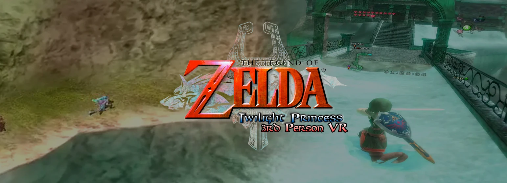

# Dusklight VR

OpenXR VR for [Dusklight](https://github.com/TwilitRealm/dusklight) 2.0 as a self-contained native mod
(`.dusk`). On Windows there is no patched Dusklight or Aurora build: drop the mod into the official
release. Standalone headsets (Quest 3) use the **Dusklight VR edition** APK, a build of Dusklight with
a VR app manifest and a few exports the mod needs; it installs beside the official app.

- **True per-eye stereo.** Each eye is rendered by the game itself with its own camera, so water, shadows,
  billboards and screen effects are correct in both eyes (the old render-twice/uniform-patching approach
  could not fix screen-space reflections).
- **6DOF head tracking** on top of the game camera, with a **level-horizon** comfort mode that removes the
  game camera's pitch and roll.
- **HUD, text and menus on an OpenXR quad layer**: crisp, composited by the runtime, never clipped.
  The HUD follows your head lazily; pause menus lock in place in front of you; 2D-only screens (title,
  file select) become a large virtual screen.
- **Cinema mode**: the flat game on a big world-locked screen.
- **Presets** for each mode (comfort / performance, living room / IMAX, desk / coffee table / floor).
- **Dusklight's own menus** (settings, mod manager) appear on a panel in the headset.
- **Tabletop mode**: the world as a small diorama on your real table (scale 1:50 by default), with
  the sky see-through so your room shows around it (passthrough, where the runtime supports it).
- **Tabletop x-ray**: when the level hides Link, a cylinder of clear view opens from your eyes to him;
  NPCs, enemies, Link and the ground under him are never cut. The HUD lies flat on the table, and the
  item wheel opens around Link without pausing (right stick to choose, Link keeps walking).
- **Aim lines** in each item's colour from the item to where the shot lands, and lock-on arrows in 3D,
  instead of the flat crosshair. The **Hawkeye** shows its zoom on a 3D screen.
- **Comfort**: aiming in stereo stays third person, the camera turns only when you turn it (option),
  and transitions fade through black.
- **VR settings window** with tabs, opened from **VR** in Dusklight's top bar.
- Frames are paced by the headset (`xrWaitFrame`) and rendered through Dusklight's frame interpolation,
  so every headset refresh gets a fresh frame instead of the game's 30 Hz simulation rate.

## Requirements

**Windows (PC VR)**
- Dusklight **v2.0**, graphics backend **D3D12** (the default). Other backends: the mod stays idle.
- Any OpenXR runtime with D3D12 support (SteamVR, Virtual Desktop, Meta Quest Link, WMR, ...).

**Quest 3 (standalone)**
- The `dusklight-vr-edition-arm64.apk` from the release (Dusklight v2.0.1 + VR manifest; the mod is
  bundled inside). Sideloading needs developer mode (SideQuest or `adb install`).
- Your own Twilight Princess (USA) disc image on the headset.
- Pico 4 and other Android OpenXR headsets: untested.

## Install

**Windows**: copy `dusklight_vr.dusk` into `%APPDATA%\TwilitRealm\Dusklight\mods` and enable it in the
Mods window. Settings open from **VR** in Dusklight's top bar (or the mod's panel in the Mods window):
mode, presets, world scale, tabletop, HUD/menu placement, recenter.

**Quest 3**: install the APK, copy the disc image to the headset (e.g. its `Download` folder), and
start **Dusklight VR** from the library (Unknown Sources). Dusklight's launch menu appears on a panel
in the headset (navigate it with the controllers): choose your disc image there (it opens the system
file picker), then start the game.

Alternatively, over adb (no spaces in the file name):

```sh
adb shell appops set dev.twilitrealm.dusk.vr MANAGE_EXTERNAL_STORAGE allow
adb shell "am start -n dev.twilitrealm.dusk.vr/dev.twilitrealm.dusk.DuskActivity --es dusk_args '--dvd /storage/emulated/0/Download/tp.iso'"
```

While a headset session is running the mod applies these in-memory overrides (never saved to your
config): frame interpolation *Unlimited*, vsync off, letterboxing off, mirror mode off.

## Performance

| | Windows (measured: Quest 3 over Virtual Desktop) | Quest 3 standalone |
| --- | --- | --- |
| Graphics | D3D12 (Dawn) → OpenXR D3D12 swapchains | Vulkan (Dawn) → AHardwareBuffer → OpenXR Vulkan swapchains |
| Stereo | GPU-bound; e.g. 45 fps at 3584x2688 per eye | 36 fps at 60% render scale (the Android default); 24–36 at 75% |
| Cinema | Full rate | Mostly 72 fps (render size capped to what the virtual screen shows) |
| Main lever | Render scale | Render scale; stereo draws the game twice (~8–9 ms per view) |

The headset reprojects missed frames for head rotation. Frame generation from motion vectors
(SpaceWarp) is not implemented yet.

## How it works

| Piece | Mechanism |
| --- | --- |
| Stereo | `mDoGph_Painter` is replace-hooked and run once per eye with the camera's `view_class` rewritten (eye pose × game view, headset off-axis frustum). Dusklight's J3D computes view×model at paint time, so the draw lists recorded by the simulation re-render correctly for each eye. Depth is cleared between eyes; UI timers are frozen for the second eye. |
| Culling | `mDoLib_clipper::setup` is widened so turning your head never reveals culled geometry. |
| HUD layer | At `GFX_STAGE_FRAME_BEFORE_HUD` the scene is snapshotted and the main framebuffer cleared to black (eye 1) / white (eye 2); the 2D phase draws over it, the result is snapshotted at `FRAME_AFTER_HUD` and the scene put back. The compositor recovers exact premultiplied alpha from the pair. |
| X-ray | Aurora's GX shaders are patched as Dawn creates them: an otherwise unused fog type selects a cut-out (cylinder from the eye to Link, near-head fade, dithered `discard`). The mod's `GXSetFog` markers and hooks on Aurora's fog register decoders give every draw of the map's lists that fog type; each eye's data sits in Aurora's storage buffer. Collision rays measure how much of Link is hidden. |
| Tabletop | The eye views are built from a table placement (player at the table centre, game-camera heading pointing away from you, scale 1:N) instead of the game camera. Frustum culling (`J3DUClipper::clip`), the sky lists and fog are switched off. At `FRAME_BEFORE_HUD` each eye's depth is snapshotted and a pass rebuilds world positions from it, fading out everything beyond the table radius / below the table into premultiplied alpha. The runtime shows the room behind it via `XR_FB_passthrough`, or the `ALPHA_BLEND` environment blend mode. |
| GPU handoff (Windows) | Eye/HUD images are composited on Aurora's render worker (GfxService compute callback) into Dawn textures whose `ID3D12Resource` is captured when they are created. Right after the frame's submit (`aurora::gfx::after_submit`), they are copied into the OpenXR swapchains on Dawn's own D3D12 queue and `xrEndFrame` is called. Dawn's device/queue come from `webgpu_dawn.dll` exports. |
| GPU handoff (Android) | Targets are AHardwareBuffers imported into Dawn as shared texture memory and into the OpenXR Vulkan device as images. Dawn's end-of-access sync fds become Vulkan wait semaphores; the copy signals a semaphore whose sync fd Dawn waits on next frame (no CPU stall). See `docs/android.md`. |
| Frame loop | `xrWaitFrame` at `aurora_begin_frame`, `xrBeginFrame` when the worker starts the frame, `xrEndFrame` after its submit. |

## Building

```sh
cmake -B build -G Ninja
cmake --build build
```

Produces `build/mods/dusklight_vr.dusk`. The OpenXR loader is fetched and linked statically.

For development against a local Dusklight checkout / game install:

```sh
cmake -B build -G Ninja -DDUSKLIGHT_DIR=<dusklight checkout> -DDUSK_GAME_EXE=<game>/sdk/windows-amd64.lib
```

`tools/run_test.ps1` launches a portable test copy of the game with the built mod. The
**Simulate headset** option runs the whole stereo pipeline without an HMD and shows both eyes
side by side on the desktop.

## Known limitations

- Screen-space post effects are computed per eye; depth of field is disabled by default for comfort,
  motion blur is always off in stereo (it would blend in the other eye's frame).

  ## AI disclosure

This mod was written/assisted with Claude Code. I, NoahsMaximum, have been directing, reviewing and play-testing every version.
Please [open an issue](https://github.com/noahsmaximum/dusklight-archipelago/issues) if you find anything.

